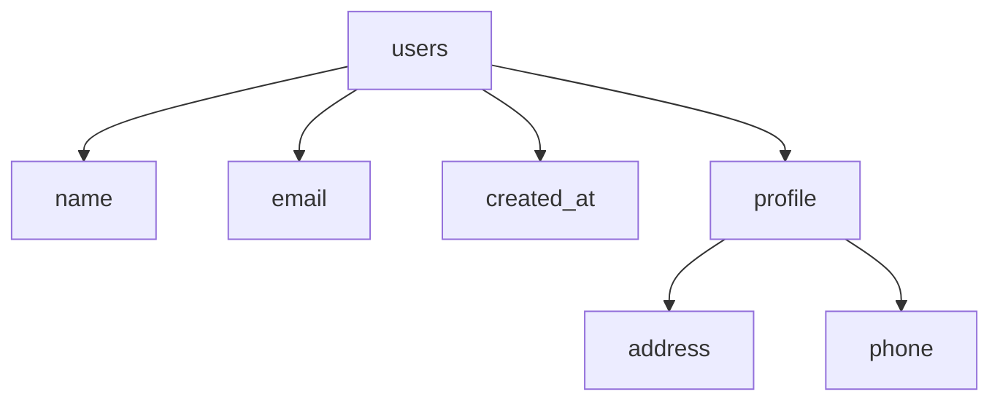

# MongoDB Schema Generator

A Python tool that generates Mermaid chart representations of MongoDB database schemas using Claude API.

## Features

- Connects to MongoDB databases and analyzes collection schemas
- Generates Mermaid charts for visual schema representation
- Supports field filtering (include/exclude specific fields)
- Configurable output formats (Markdown or pure Mermaid)
- Uses Claude API for intelligent schema visualization
- Docker support for easy deployment
- Automatic schema relationship detection
- Field type inference from sample documents

## Prerequisites

- Python 3.8 or higher
- Docker (optional, for containerized deployment)
- MongoDB instance
- Claude API key

## Installation

### Option 1: Using pip

```bash
pip install mongodb-schema-generator
```

### Option 2: From source

```bash
git clone https://github.com/yourusername/mongodb-schema-generator.git
cd mongodb-schema-generator
pip install -e .
```

### Option 3: Using Docker

```bash
git clone https://github.com/yourusername/mongodb-schema-generator.git
cd mongodb-schema-generator
docker compose up --build
```

## Configuration

1. Copy `.env.sample` to `.env` and update with your credentials:
```bash
cp .env.sample .env
```

2. Update `.env` with your MongoDB URI and Claude API key:
```
MONGODB_URI=mongodb://localhost:27017
CLAUDE_API_KEY=your_claude_api_key_here
```

3. Copy `config.yaml.template` to `config.yaml` and update the settings:
```yaml
mongodb:
  database: "your_database"
  
schema:
  exclude_fields: []
  include_fields: []
  sample_size: 100
  
output:
  directory: "schemas"
  format: "md"
```

## Usage

### Using Python

```bash
mongodb-schema-generator --config path/to/config.yaml
```

### Using Docker

```bash
./scripts/start.sh  # Start the container
./scripts/logs.sh   # View logs
./scripts/stop.sh   # Stop the container
```

The schema generator will:
1. Connect to your MongoDB database
2. Analyze all collections
3. Generate Mermaid charts for each collection's schema
4. Save the charts in the specified output directory

## Example Output

For a collection named `users`:



## Contributing

Contributions are welcome! Please feel free to submit a Pull Request.

## License

This project is licensed under the MIT License - see the [LICENSE](LICENSE) file for details.
